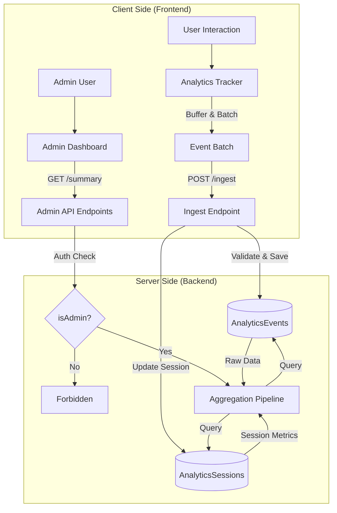

# Admin Analytics Dashboard Implementation Plan

## 1. System Architecture

### Data Model

We will use MongoDB to store analytics data, separated into `AnalyticsEvent` for high-volume event stream and `AnalyticsSession` for user session context.

#### `AnalyticsEvent` Schema
Stores individual user actions and system events.

```typescript
import mongoose, { Schema, Document } from 'mongoose';

export interface IAnalyticsEvent extends Document {
  sessionId: string;
  userId?: string;
  eventType: string; // e.g., 'page_view', 'donation_click', 'signup', 'error'
  eventName?: string; // e.g., 'Home Page', 'Charity A'
  category?: string; // e.g., 'navigation', 'conversion', 'interaction'
  metadata?: Record<string, any>; // Flexible payload for event details
  url: string;
  referrer?: string;
  timestamp: Date;
}

const AnalyticsEventSchema: Schema = new Schema(
  {
    sessionId: { type: String, required: true, index: true },
    userId: { type: Schema.Types.ObjectId, ref: 'User', index: true },
    eventType: { type: String, required: true, index: true },
    eventName: { type: String },
    category: { type: String, index: true },
    metadata: { type: Map, of: Schema.Types.Mixed },
    url: { type: String, required: true },
    referrer: { type: String },
    timestamp: { type: Date, default: Date.now, index: true },
  },
  { 
    timestamps: { createdAt: true, updatedAt: false },
    expireAfterSeconds: 31536000 // Optional: TTL index for 1 year retention
  }
);

// Compound index for common queries
AnalyticsEventSchema.index({ eventType: 1, timestamp: -1 });
AnalyticsEventSchema.index({ sessionId: 1, timestamp: 1 });

export default mongoose.model<IAnalyticsEvent>('AnalyticsEvent', AnalyticsEventSchema);
```

#### `AnalyticsSession` Schema
Tracks user sessions to calculate duration, retention, and session-level metrics.

```typescript
import mongoose, { Schema, Document } from 'mongoose';

export interface IAnalyticsSession extends Document {
  sessionId: string;
  userId?: string;
  startTime: Date;
  lastActivity: Date;
  endTime?: Date;
  duration?: number; // in seconds
  deviceType: string; // 'mobile', 'desktop', 'tablet'
  browser: string;
  os: string;
  country?: string; // Geo-location from IP (if applicable)
  pageViews: number;
}

const AnalyticsSessionSchema: Schema = new Schema(
  {
    sessionId: { type: String, required: true, unique: true },
    userId: { type: Schema.Types.ObjectId, ref: 'User', index: true },
    startTime: { type: Date, default: Date.now, index: true },
    lastActivity: { type: Date, default: Date.now },
    endTime: { type: Date },
    duration: { type: Number },
    deviceType: { type: String },
    browser: { type: String },
    os: { type: String },
    country: { type: String },
    pageViews: { type: Number, default: 0 },
  },
  { timestamps: true }
);

export default mongoose.model<IAnalyticsSession>('AnalyticsSession', AnalyticsSessionSchema);
```

### Data Flow Diagram



### Security

#### Admin Authorization Strategy
Since the current system appears to have basic user roles, we will implement a robust `isAdmin` middleware.

1.  **Environment Variable**: Define `ADMIN_EMAILS` in `.env` containing a comma-separated list of authorized email addresses.
2.  **Middleware Implementation**:
    *   Intercepts requests to `/api/v1/analytics/*` (except ingest).
    *   Verifies if the requestor's email matches the allowed list.
    *   Returns `403 Forbidden` if unauthorized.

```typescript
// backend/src/middleware/auth.ts
export const isAdmin = async (req: Request, res: Response, next: NextFunction) => {
  // ... verification logic ...
};
```

#### Rate Limiting
*   **Ingest Endpoint**: High limit (e.g., 100 requests/minute per IP) to accommodate rapid event firing.
*   **Admin Read Endpoints**: Strict limit (e.g., 60 requests/minute) to prevent abuse of expensive aggregation queries.

### API Specification

#### 1. Ingestion Endpoint
*   **URL**: `POST /api/v1/analytics/ingest`
*   **Access**: Public (Rate limited)
*   **Payload**:
    ```json
    {
      "events": [
        {
          "eventType": "page_view",
          "url": "/donations",
          "timestamp": "2023-10-27T10:00:00Z",
          "sessionId": "uuid-v4",
          "metadata": { ... }
        }
      ],
      "deviceInfo": { ... } // Sent once per session init or batch
    }
    ```
*   **Response**: `202 Accepted` (Async processing recommended)

#### 2. Admin Read Operations (Protected)
*   **Summary Stats**: `GET /api/v1/analytics/summary?range=7d`
    *   Returns: Total Users, Total Sessions, Avg Session Duration, Bounce Rate.
*   **Time Series**: `GET /api/v1/analytics/timeseries?metric=page_views&range=30d`
    *   Returns: Array of `{ date: string, value: number }`.
*   **Funnels**: `GET /api/v1/analytics/funnels`
    *   Returns: Conversion rates for defined steps (e.g., Landing -> Donation Form -> Success).

---

## 2. Frontend Architecture

### Tracking Utility (`AnalyticsTracker`)
A singleton class or custom hook to handle client-side tracking logic.

*   **Buffering**: Events are not sent immediately. They are pushed to a queue and flushed every X seconds (e.g., 5s) or when the queue reaches a size limit (e.g., 10 events), or on `visibilitychange` (page unload).
*   **Session Management**:
    *   Generate a UUID v4 for `sessionId` on first visit.
    *   Store in `localStorage` / `sessionStorage`.
    *   Refresh session if inactive for > 30 minutes.
*   **Automatic Page View**: Integrate with `react-router-dom`'s `useLocation` to automatically track route changes.

### Dashboard UI (`/admin/analytics`)
*   **Layout**: Sidebar layout sharing the admin shell.
*   **Components**:
    *   `SummaryCards`: Grid of key metrics (Active Users, Total Donations, etc.).
    *   `TimeSeriesChart`: Line/Area chart using `recharts` to show trends over time.
    *   `FunnelView`: Bar chart or specialized funnel visualization.
    *   `RecentActivityTable`: List of latest significant events.
*   **Libraries**:
    *   `recharts` for visualization.
    *   `tanstack/react-query` for data fetching and caching.
    *   `lucide-react` for icons.

---

## 3. Phased Execution Strategy

### Phase 1: Backend Core
1.  **Setup Models**: Create `AnalyticsEvent` and `AnalyticsSession` schemas.
2.  **Ingest API**: Implement `POST /ingest` with batch processing logic.
3.  **Database**: Verify indexing strategy for performance.

### Phase 2: Frontend Instrumentation
1.  **Tracker**: Build `AnalyticsTracker` utility.
2.  **Integration**: Add tracker to `App.tsx` (or root provider).
3.  **Events**: instrument key interactions:
    *   Page Views (global)
    *   Donation Start/Complete
    *   Charity Click
    *   Filter Usage

### Phase 3: Dashboard UI & Admin Features
1.  **Middleware**: Implement `isAdmin` middleware.
2.  **Aggregations**: Create backend endpoints for Summary, Timeseries, and Funnels using MongoDB Aggregation Pipeline.
3.  **UI Construction**: Build the React pages and components for the dashboard.
4.  **Integration**: Connect UI to Admin APIs.

---

## 4. Testing Strategy

### Data Accuracy
*   **Validation**: Verify that buffered events are flushed correctly on page navigation and tab close.
*   **Session Continuity**: Test that refreshing the page maintains the same `sessionId`.

### Security
*   **Unauthorized Access**: Attempt to access `/admin/analytics` endpoints without proper credentials (should 403).
*   **Payload Validation**: Send malformed JSON to `/ingest` to ensure graceful rejection.

### Performance
*   **Load Test**: Use `k6` or `Apache Bench` to flood `/ingest` with events to ensure the backend doesn't block main threads.
*   **Query Optimization**: Check `explain()` plans for aggregation queries to ensure indexes are used.