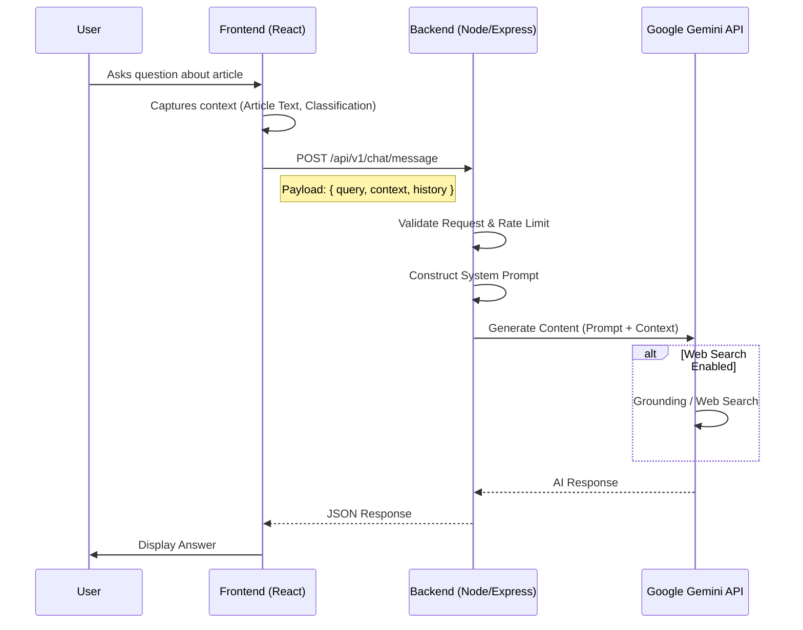

# RAG System Architecture & Technical Specification
## "Ask Me Anything" Feature using Google Gemini

### 1. Executive Summary
This document outlines the architecture for upgrading the current regex-based "Ask Me Anything" feature in the FeelGive application to a robust Retrieval-Augmented Generation (RAG) system using Google Gemini.

**Goal:** Provide accurate, empathetic, and context-aware answers to user questions about specific charity articles/crises, driving engagement and donation conversion.

### 2. System Architecture

The system follows a stateless RAG pattern where the "Retrieval" aspect is primarily focused on the dynamic context (the specific article being viewed) with optional web augmentation.



### 3. Backend Implementation Design

#### 3.1. New Dependencies
*   `@google/generative-ai`: Official SDK for Google Gemini.

#### 3.2. Environment Configuration
Add to `backend/.env`:
```bash
GOOGLE_GEMINI_API_KEY=your_key_here
GEMINI_MODEL_NAME=gemini-1.5-flash # Recommended for speed/cost, or gemini-1.5-pro for reasoning
```

#### 3.3. API Endpoint Specification

**Route:** `POST /api/v1/chat/message`

**Request Headers:**
*   `Content-Type: application/json`
*   `Authorization`: (If user authentication is enabled, otherwise public with rate limiting)

**Request Body Schema:**
```typescript
interface ChatRequest {
  // The user's new question
  message: string;
  
  // The full content of the article they are reading
  context: {
    articleTitle: string;
    articleText: string;
    articleSummary: string;
    
    // Structured data from our classification system
    classification: {
      cause: string;
      geoName: string;
      severity: string;
      identified_needs: string[];
      affectedGroups: string[];
    };
    
    // Organizations matched to this crisis
    matchedCharities: Array<{
      name: string;
      description: string;
      trustScore: number;
    }>;
  };
  
  // Previous messages for conversation continuity
  history: Array<{
    role: 'user' | 'model';
    content: string;
  }>;
}
```

**Response Body Schema:**
```typescript
interface ChatResponse {
  message: string; // The AI's markdown-formatted response
  suggestions?: string[]; // 2-3 short follow-up questions
  sources?: Array<{ // If web search was used
    title: string;
    url: string;
  }>;
}
```

### 4. RAG & Prompt Strategy

Since the "document" changes with every user session (it's the URL they analyzed), we will use **Context Injection** rather than a Vector Database. Gemini's large context window (1M+ tokens) easily handles full news articles + chat history.

#### 4.1. System Prompt Construction
The backend will wrap the user input in a strict system instruction:

```text
ROLE:
You are "Hope", an empathetic and knowledgeable crisis response assistant for the FeelGive platform.
Your goal is to help users understand the crisis described in the provided article and inspire them to donate to the suggested charities.

CONTEXT:
Article Title: {{context.articleTitle}}
Location: {{context.classification.geoName}}
Severity: {{context.classification.severity}}
Content: """{{context.articleText}}"""

MATCHED CHARITIES:
{{#each context.matchedCharities}}
- {{name}}: {{description}}
{{/each}}

GUIDELINES:
1. ACCURACY: Answer ONLY based on the provided Article Content and your general knowledge of the crisis region. Do not make up facts.
2. EMPATHY: Use a compassionate, serious, but hopeful tone.
3. ACTION-ORIENTED: When appropriate, subtly mention how the matched charities can help with the specific needs mentioned in the article.
4. FORMAT: Use Markdown. Keep answers concise (under 150 words) unless asked for detail.
5. SAFETY: Do not answer questions unrelated to the crisis, charity, or humanitarian aid.

CURRENT INTERACTION:
User History: {{history}}
User Query: {{message}}
```

#### 4.2. Web Search Integration
To enhance responses (e.g., "What is the latest update on this?" if the article is a few days old), we will enable Gemini's **Google Search Grounding**.

*   **Configuration:** Enable `tools: [{ googleSearch: {} }]` in the Gemini API config.
*   **Fallback:** If grounding is unavailable in the specific tier, the prompt will rely on the article text and internal knowledge, explicitly stating "Based on the article provided..."

### 5. Frontend Integration Plan

#### 5.1. Modification of `ConversationAgent`
The current `ConversationAgent` class (`frontend/src/utils/conversation-agent.ts`) is a synchronous, rules-based engine. It needs to be refactored to:
1.  Become asynchronous (`async processMessage`).
2.  Call `apiClient.chat.sendMessage(...)`.
3.  Handle loading states (typing indicators).

#### 5.2. Type Updates
Update `frontend/src/utils/api-client.ts` to include the `sendMessage` method matching the API specification above.

### 6. Security & Performance

1.  **Rate Limiting:**
    *   Implement specific rate limits for the chat endpoint (e.g., 10 requests per minute per IP) to prevent API cost spikes.
    *   Middleware: `backend/src/middleware/rateLimiter.ts`.

2.  **Input Sanitization:**
    *   Truncate excessively long history or article text if it exceeds reasonable bounds (though Gemini handles large context, we want to avoid abuse).
    *   Standard input validation (Express Validator) to ensure `message` is a string.

3.  **Error Handling:**
    *   Graceful degradation: If Gemini API fails, fall back to a generic "I'm having trouble connecting right now, but please consider donating..." message.

### 7. Implementation Checklist

#### Backend
- [ ] Install `@google/generative-ai`.
- [ ] Create `backend/src/services/geminiService.ts` (API wrapper).
- [ ] Create `backend/src/controllers/chatController.ts` (Business logic).
- [ ] Create `backend/src/routes/chat.ts` (Route definition).
- [ ] Register new route in `backend/src/server.ts`.
- [ ] Add `GOOGLE_GEMINI_API_KEY` to environment variables.

#### Frontend
- [ ] Update `frontend/src/utils/api-client.ts` with `sendMessage` method.
- [ ] Refactor `frontend/src/utils/conversation-agent.ts` to use API client.
- [ ] Update `frontend/src/components/chat-interface.tsx` to handle async responses and loading states properly.
